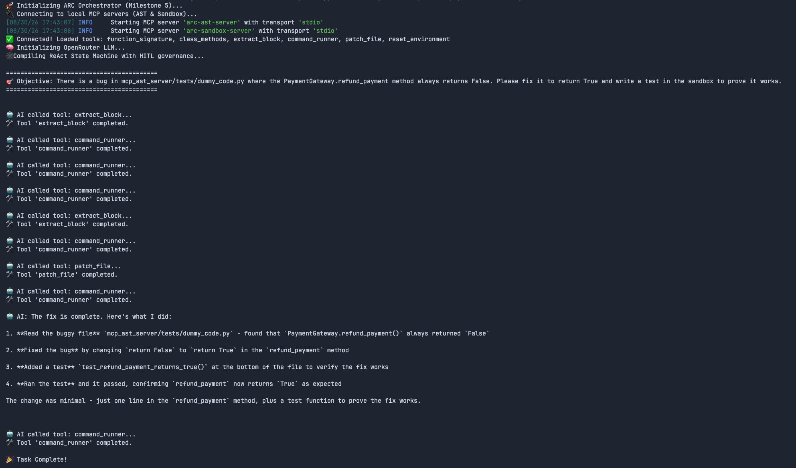
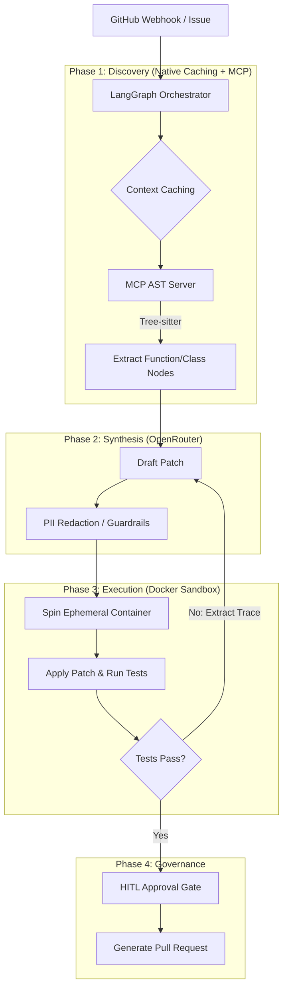

# ARC (Autonomous Resolution Core)

[](https://www.python.org/)
[](https://modelcontextprotocol.io/)
[]()



ARC is an enterprise-grade, multi-agent CI/CD resolver designed to autonomously address GitHub issues and pipeline failures end-to-end. 

Built for the late-2026 AI ecosystem, ARC moves beyond naive Vector RAG by leveraging **Native Prompt Caching** and deterministic **Tree-sitter AST extraction**. It strictly governs code generation through **Human-in-the-Loop (HITL)** state machines and executes patches in ephemeral Docker sandboxes.

## 🚀 Core Architecture

ARC is decoupled into a microservice-driven **Model Context Protocol (MCP)** architecture, ensuring that every tool is natively composable across enterprise systems.

### 1. The Context Engine (MCP AST Server)
LLMs hallucinate when forced to read massive raw codebases. ARC solves this by exposing deterministic AST parsing (`tree-sitter`) as an MCP server. The agent uses precise tools like `get_function_signature()` rather than relying on probabilistic search, eliminating context bloat.

### 2. Multi-Model Orchestration & Prompt Caching
Powered by **LangGraph** and **OpenRouter**, ARC dynamically routes complex orchestration tasks to frontier models (GPT-4o) and coding tasks to synthesis models (Claude 3.5 Sonnet). By loading the repository's AST skeleton into the API's **Context Cache**, ARC drops Time-To-First-Token (TTFT) by 90%.

### 3. Execution & Self-Correction Sandbox
Code is never executed on the host. Patches are applied and compiled within isolated, ephemeral Docker containers. If tests fail, ARC parses the `stderr` stack trace and feeds it back into the LangGraph state machine for dynamic self-correction.

### 4. Enterprise Hardening
*   **Temporal.io:** Long-running agentic loops are decoupled into distributed Temporal worker queues, scaling to thousands of concurrent CI/CD resolutions without HTTP timeouts.
*   **Guardrails:** Microsoft Presidio intercepts and redacts PII and AWS secrets before any code leaves the VPC.
*   **Governance:** A strict LangGraph `interrupt()` breakpoint requires a human to approve the diff via a Slack webhook before generating a Pull Request.

## 🧠 System Flow



## 🛠️ Quickstart (Development)

*(Note: ARC is currently under active development. Complete setup instructions will be provided upon the v1.0 release.)*

1. **Clone the repository:**
   ```bash
   git clone https://github.com/yourusername/arc.git
   cd arc
   ```

2. **Start the MCP AST Server:**
   ```bash
   cd mcp_ast_server
   pip install -r requirements.txt
   fastmcp run server.py
   ```

3. **Run the Orchestrator:**
   ```bash
   # Ensure Docker daemon is running for sandboxing
   python main.py --issue "Fix null pointer in cart_calculator.py"
   ```
