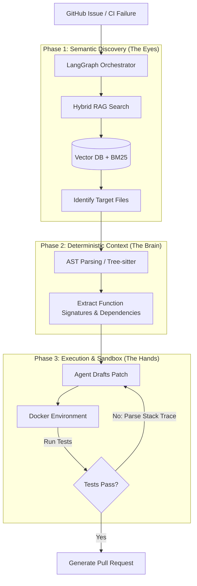

# ARC (Autonomous Resolution Core)
## Design Proposal: Hybrid RAG & AST Coding Agent

### 1. Abstract
ARC is an autonomous, multi-agent CI/CD resolver designed to address GitHub issues end-to-end. It bridges the gap between probabilistic AI search (RAG) and deterministic software engineering by utilizing a Hybrid Architecture. ARC uses Semantic RAG to *discover* relevant code across large repositories and Abstract Syntax Tree (AST) parsing to *read and edit* code with structural precision. All code execution and testing are performed securely within an ephemeral Docker sandbox.

### 2. Problem Statement
Current "AI Coding Assistants" suffer from three major flaws when operating autonomously on large codebases:
1.  **Context Bloat:** Dumping entire codebases into 1M+ token windows is expensive, slow, and leads to "lost-in-the-middle" hallucinations.
2.  **Naive RAG Limitations:** Standard Vector RAG is excellent for natural language but fails at code syntax retrieval (e.g., retrieving a function signature often pulls in unrelated comments or test files).
3.  **Destructive Edits:** LLMs struggle to apply diffs or patches accurately without breaking syntax. 

### 3. Proposed Architecture
ARC solves these issues through a 3-stage pipeline governed by a state machine.

### 4. Core Components

#### 4.1. The Orchestrator (LangGraph)
*   **Role:** Manages the ReAct (Reason + Act) loop, preventing infinite loops and managing state transitions between searching, reading, writing, and testing.
*   **State Management:** Maintains a memory of attempted fixes and compiler errors to prevent the agent from repeating the same mistakes.

#### 4.2. Semantic Discovery Engine (Hybrid RAG)
*   **Role:** Maps natural language issue descriptions (e.g., *"Fix cart calculation bug"*) to physical files in the repository.
*   **Mechanism:** Uses a Vector DB (e.g., Qdrant) with Hybrid Search. 
    *   *Dense Vectors (Embeddings):* Captures the semantic intent of the issue.
    *   *Sparse Vectors (BM25):* Captures exact keyword matches (e.g., specific variable names or error codes).

#### 4.3. Deterministic Code Engine (Tree-sitter AST)
*   **Role:** Once files are identified, ARC uses Tree-sitter to parse the code into a structural graph.
*   **Mechanism:** Instead of reading raw text, the agent is provided with tools like `get_function_body(file, func_name)` or `find_references(class_name)`. This guarantees 100% accurate context retrieval and allows precise block-level code replacement.

#### 4.4. Secure Execution Sandbox (Docker)
*   **Role:** An isolated environment where the agent's proposed bash commands and code patches are executed.
*   **Mechanism:** Clones the target repo into a lightweight container. The agent runs `pytest` or `npm test` internally, reads the `stdout/stderr`, and feeds it back into the LangGraph state for self-correction.

### 5. Proposed Tech Stack
*   **Agent Framework:** LangGraph (Python)
*   **LLM Provider:** OpenAI GPT-4o (Primary reasoning) / Claude 3.5 Sonnet (Coding)
*   **Vector DB:** Qdrant or Pinecone (supports Hybrid Search)
*   **Embeddings:** OpenAI `text-embedding-3-small`
*   **AST Parser:** Tree-sitter (via `tree-sitter-python` / `tree-sitter-javascript`)
*   **Sandboxing:** Docker SDK for Python
*   **Observability:** Langfuse (Critical for tracing token usage and agent loops)

### 6. Implementation Roadmap

#### Phase 0: Foundations (Weeks 1-2)
*   [ ] Initialize Python project and CI/CD pipelines.
*   [ ] Implement the Docker SDK wrapper for sandboxed execution.
*   [ ] Build basic Tree-sitter tools (`read_function`, `list_classes`).

#### Phase 1: Semantic RAG Integration (Weeks 2-3)
*   [ ] Implement repository ingestion script (chunking files).
*   [ ] Set up Qdrant Vector DB with Hybrid Search capabilities.
*   [ ] Connect the LangGraph orchestrator to the Vector DB for "File Discovery".

#### Phase 2: The Agentic Loop (Weeks 3-4)
*   [ ] Build the LangGraph state machine (Discover -> Read -> Edit -> Test).
*   [ ] Implement the diff/patch application logic.
*   [ ] Integrate Langfuse for tracing.

#### Phase 3: Evaluation & Refinement (Weeks 5+)
*   [ ] Benchmark against a 50-issue subset of **SWE-bench Lite**.
*   [ ] Tune prompts and hybrid search weights based on evaluation metrics.

### 7. Evaluation Strategy
Success will not be measured by unit tests alone, but by system-level benchmarking:
1.  **Resolution Rate:** Percentage of SWE-bench Lite issues successfully resolved (Target: >10%).
2.  **Token Efficiency:** Average cost per resolved issue (Target: <$0.50).
3.  **Self-Correction Rate:** How often the agent successfully recovers from a failing test inside the sandbox.
